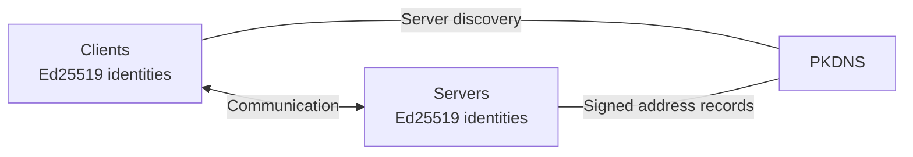
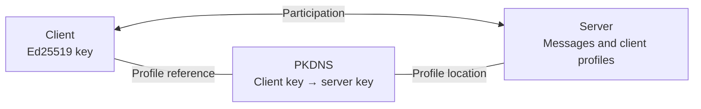

# harmon-architecture

Harmon is built around [Ed25519](https://www.rfc-editor.org/rfc/rfc8032) cryptographic keys, which identify both clients and servers.

### server

A server stores messages and participant profiles.

For communication to take place, clients need to resolve servers' public keys to network addresses. This is done through [PKDNS](https://github.com/pubky/pkdns), which provides DNS over [BitTorrent's Mainline DHT](https://www.bittorrent.org/beps/bep_0005.html).

### client

A client can use [PKDNS](https://github.com/pubky/pkdns) to indicate which Harmon server stores its profile, allowing other clients to find its profile data using its public key.

